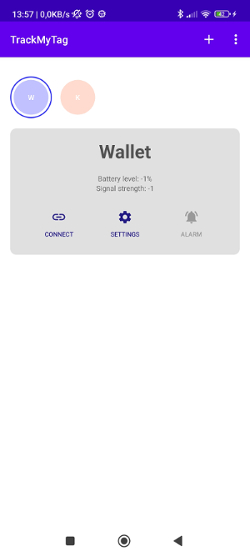
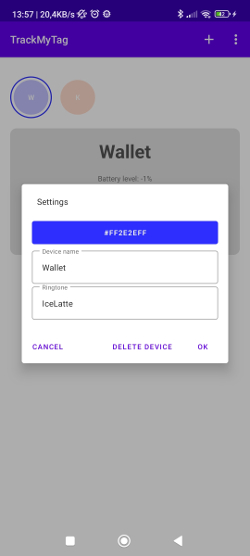

# TrackMyTag
This app allows us to connect with Bluetooth beacon devices (iTags) and monitor their status. Attached to valuable items, the iTag along with the app may prove helpful in keeping those safe within the proximity of the owner, as well as providing the way of finding them if they are hidden and nowhere to be found.
## Preview

## Features
- Connect, add to the database and manage owned iTags.
- Setup the distance at which you will be notified of missing beacon.
- Set off an alarm in the iTag device.
## Built with
- Kotlin
- Bluetooth Low Energy
- MVVM
- Hilt
- Coroutines
- Kotlin Flow
- View and Data Binding
- Room
